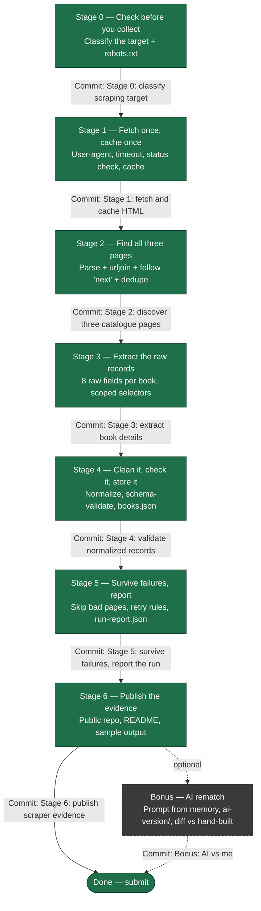
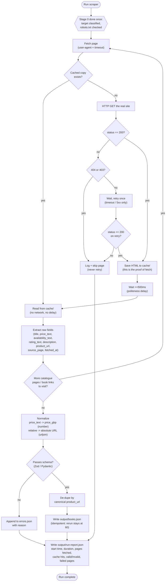

# W5 · A9 — The Polite Scraper: Workflow

Source: `W5 - The polite scraper.pdf` (FlyRank Internship, Backend Track, Week 5, Assignment A9).
This is a reference map of the assignment, not a build order to copy-paste — work each stage yourself,
checkpoint it, then commit.

## 1. Stage roadmap (the 7 stages + bonus)

Each stage box lists its **checkpoint** (how you prove it works) and its **commit message**.

| Stage | Checkpoint (proves it works) |
| --- | --- |
| 0 | README names target, 3-page scope, robots result, and the "won't reuse without checking" sentence |
| 1 | Run twice: 1st prints `FETCH` + creates file, 2nd prints `CACHE HIT`; both report response size |
| 2 | Prints `catalogue_pages=3, discovered=60, unique_urls=60`; rerun matches, mostly cache |
| 3 | Prints one full raw record (all 8 keys) + `detail_pages=60` |
| 4 | `books.json` = exactly 60 records, all `price_gbp` numeric, all URLs `https://`; stable on rerun |
| 5 | With one fake URL injected: run still finishes, 60 good records survive, `run-report.json` shows `failed_pages: 1` |
| 6 | Stranger clones repo → one command → `books.json` + `run-report.json` in <5 min; `git log --oneline` shows 7+ commits |

## 2. The data pipeline itself (what runs each time)

This is the "big idea in 60 seconds" table from the PDF, drawn as the actual per-page control flow —
what Stages 1–5 build up into.

## 3. Key rules to keep visible while building

- **Politeness, every real request:** honest `User-Agent`, a `timeout`, a `>=500ms` delay, a status-code
  check before parsing — cached reads skip all of this.
- **Never invent data.** Missing `description` -> `null`. Never guess a field that wasn't on the page.
- **Retry policy:** retry once on timeout/`5xx`. Never retry `404` (won't exist) or `403` (site said no).
- **Idempotency:** rerunning the whole pipeline must still produce exactly 60 records in `books.json` —
  not 120. Identity = canonical (absolute) `product_url`.
- **Provenance:** every record keeps `source_page` and `fetched_at` — never overwritten.
- **`cache/` is gitignored** — only code + one sample output gets committed, per Stage 6.

## 4. Glossary quick-reference

| Term | One-line meaning |
| --- | --- |
| Sandbox | A site built for people to practice scraping on — your permission source |
| Cache | A saved local copy, read instead of re-requesting the live site during dev |
| Relative / Absolute URL | Partial link vs. full `https://...` link (convert with `urljoin`, never string concat) |
| Provenance | Where + when a fact came from, kept on every record |
| Canonical URL | The one address chosen as a record's stable identity |
| Idempotency | Running the job twice gives the same result, not duplicates |
| Schema validator | Checks a record has the right fields/types before storage (Zod / Pydantic) |
| Exponential backoff | Wait longer after each failed retry (1s, 2s, 4s...) |
| Retry-After | Server-specified wait time header — obey it instead of guessing |
